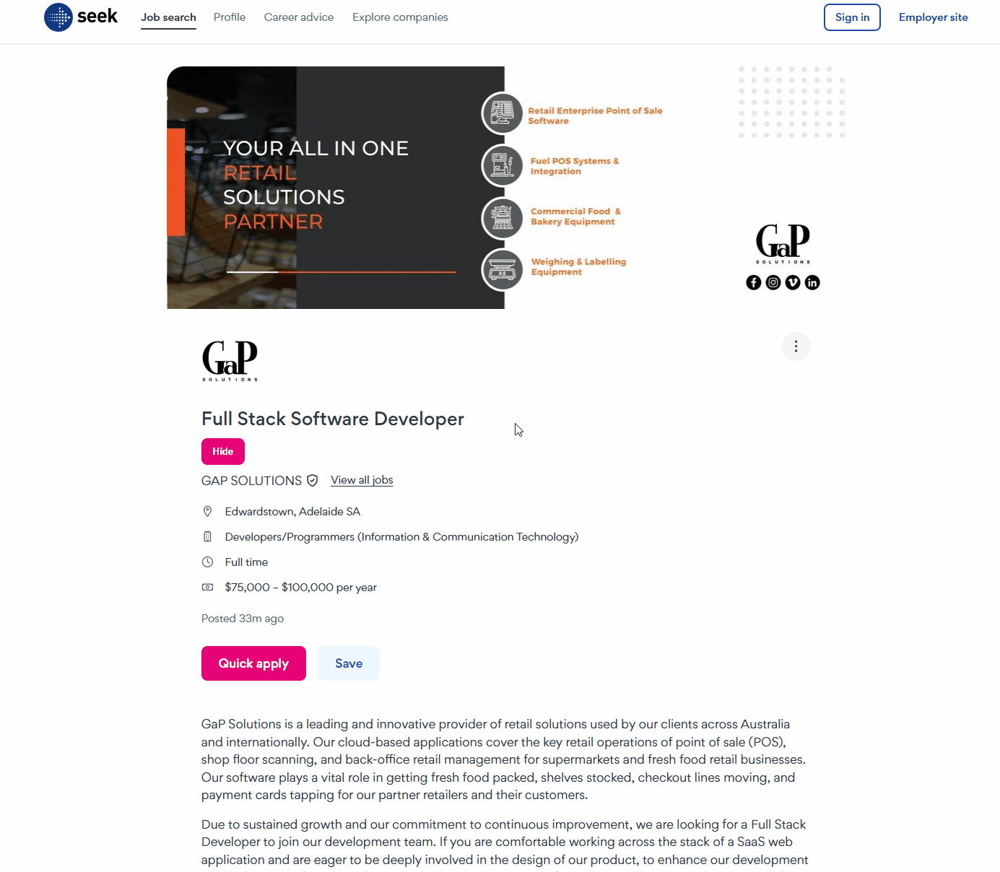

## What is Seek Toolkit?

Seek Toolkit is a browser extension that adds extra functionality to seek.com.au.

## Installation

The extension will be available soon on the Chrome and Firefox stores. In the meantime, you can install it directly from the source code:

1. Clone this repository
2. Install the dependencies

    ```pnpm install```

3. Build the extension

    ```pnpm build```

4. Load it as an unpacked extension in your browser

## Features

Simplify your job search by hiding irrelevant listings on Seek.com.au. This extension lets you hide jobs you've already reviewed, keeping your search results clean and focused on new opportunities. 

### Hide a job from the job search


### Hide a job directly from the job page



## Disclaimer

This extension is not connected with, or approved by, Seek Limited.
